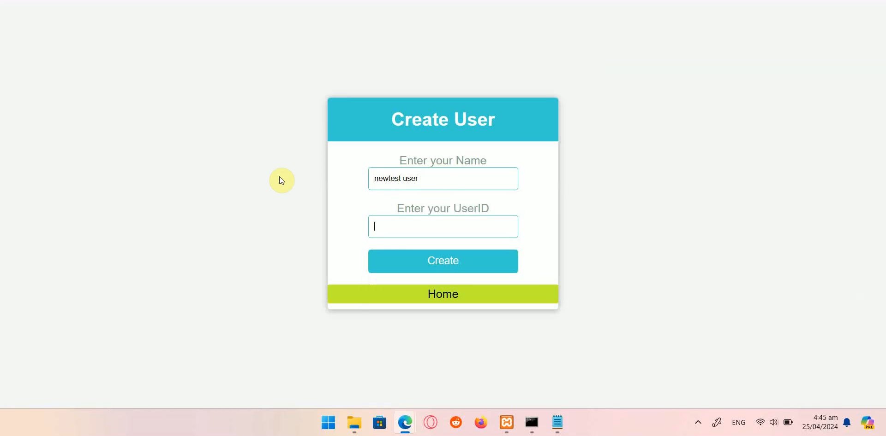
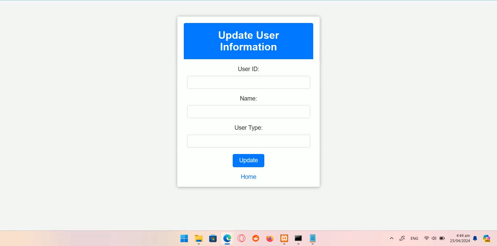
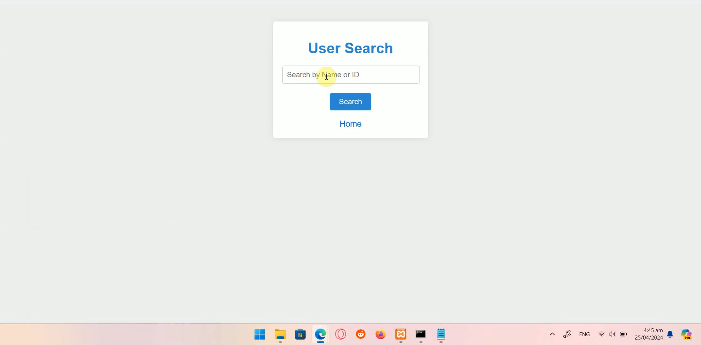
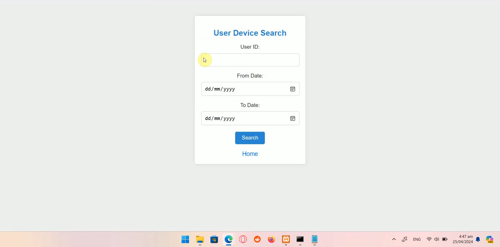
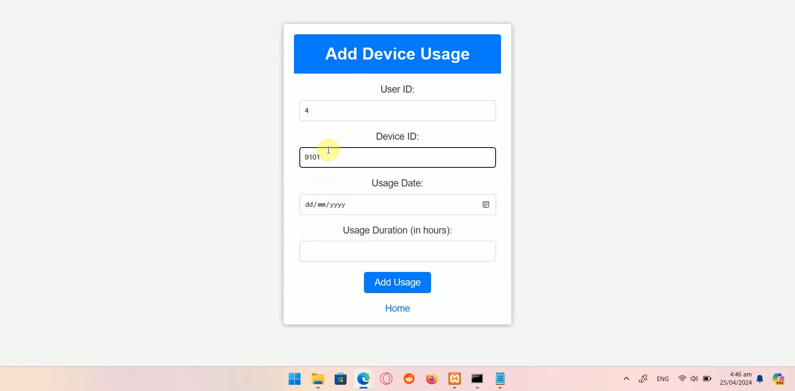

# 📱 User Device Management System  

A **web-based application** built using **Java Servlets, MySQL, and JavaScript** for managing users and tracking device usage efficiently.  

  

---

## 🚀 Features  

✅ **User Management**: Create, search, update, and delete users.  
✅ **Device Usage Tracking**: Record and retrieve user device usage history.  
✅ **Advanced Search**: Filter user usage history by date range.  
✅ **RESTful API**: Java Servlets for backend communication.  
✅ **AJAX Implementation**: Real-time interactions with the database.  
✅ **MySQL Database**: Efficient storage with relational schema.  

---

## 🛠️ Tech Stack  

- **Backend**: Java Servlets, JDBC  
- **Frontend**: HTML, CSS, JavaScript, AJAX  
- **Database**: MySQL (phpMyAdmin)  
- **Server**: Apache Tomcat  

---

## 📸 Screenshots  

### 🖥️ **Dashboard**  
  

### 🏷️ **Create User**  
  

### ✏️ **Update User Information**  
  

### 🔍 **User Search**  
  

### 📊 **Advanced Search (User Device Usage)**  
  

### ⏳ **Add Device Usage**  
  

---

## 🎬 Demo Video  

📹 **Watch the project in action!**  

<video width="700" controls>
  <source src="Demo_Video.mp4" type="video/mp4">
  Your browser does not support the video tag.
</video>
---
